# easyMeal
easyMeal is a web-based application built to bring restaurant business in one platform providing quality service to its customer through a proper communication channel between customers and restaurants. 
## Features of application
- System can recognize admin and normal user on login and respond accordingly.
- Different admin panel for different restaurant owner.
- Customer can place order (restaurant order or home delivery order) via online menu.
- Order request can be printed using printer.
- User can create a booking request for different events such as weeding, meeting, conference, celebration etc.
- User can send feedback to system admin using feed form which will send email to system admin which contains feedback of user. 
- When events (order, booking) are created admin will be notified. 
- Restaurant admin will have their own admin panel where they can receive order, get booking request and manage menu.
- User can start online conversation with system admin. 
- Admin user will have working calculator in admin dashboard to calculate bills. 
- Customer can navigate restaurant using Google map that is available in restaurant page with restaurant location assigned on it.
#### Technology Used
HTML5, CSS3, Bootstrap, javaScript, Php, laravel, mySql, sublime text3, tawk.io, mailtrap.io
#### Architecture Used ####
MVC (model view controller)
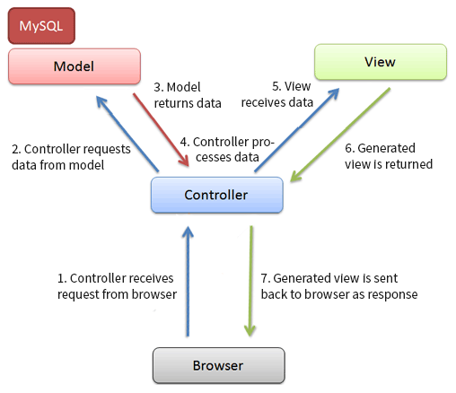

#### Usecase and class diagram
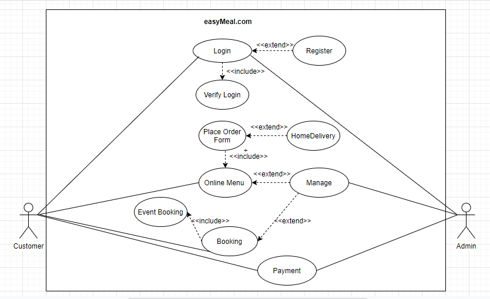  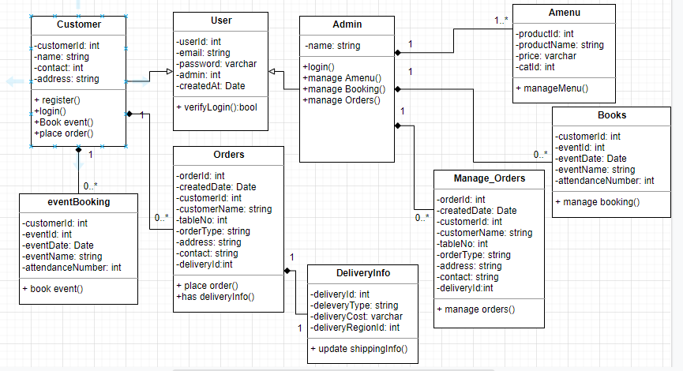

# Login and  Regestration page
Login and new regestration is possible via these pages
> ***Features of Login and  Regestration page***
- Proper validation
- Recognize admin and normal user on login and respond accordingly.
- Throw error if validation is not meet.
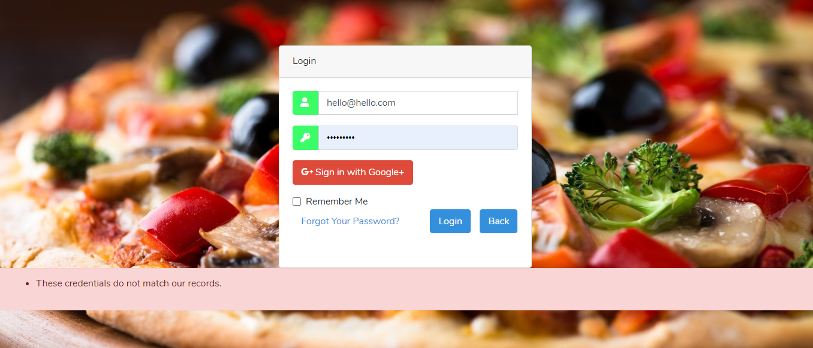 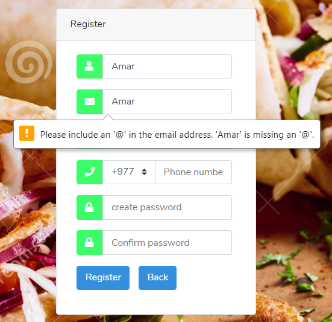
# Home-Page
If user login to system is normal user, they are directed to home page.
> ***Features of home page***
- Choose restaurant for service
- Information related to application 
- Chat with admin
- Feedback form
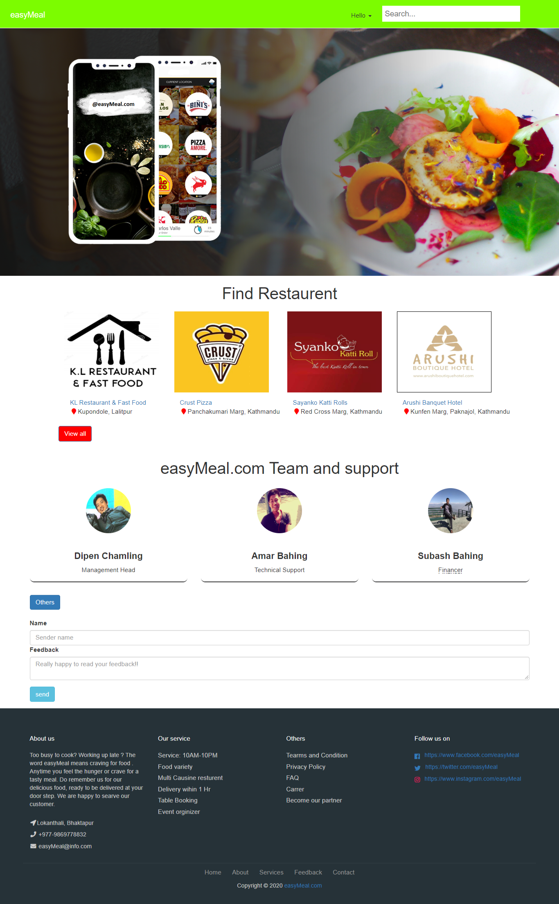
### feedback from user ###
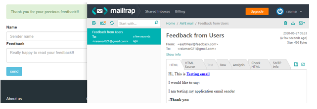
### chat with Admin user ###
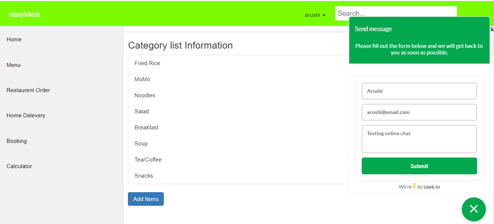
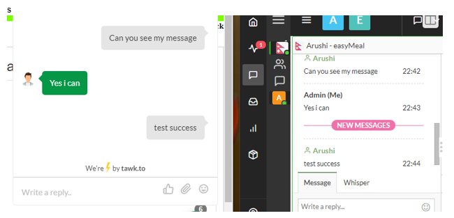
## Restaurant page
User can navigate to prefered restaurant for service
> ***Features of Restaurant page***
- Online menu
- Item under the respective category
- Table order/home delevery order
- Event Booking
- About restaurant and their other branch, along with opening and closing time.
- Google map for easy navagation
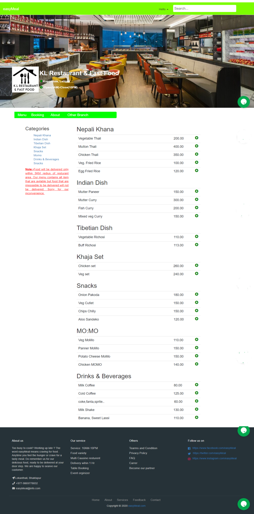

## Admin page
If user is admin this page will be displayed. Different admin page for different admin users.
> ***Features of Restaurant page***
- Notification on order request
- Add, delete and modify menu
- Print order and booking list
- Calculate total price 
>
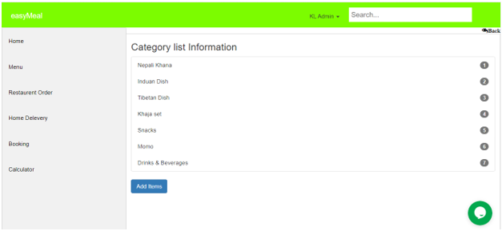 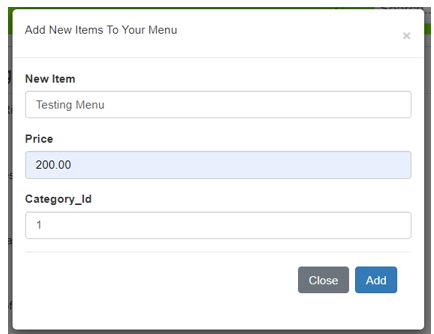 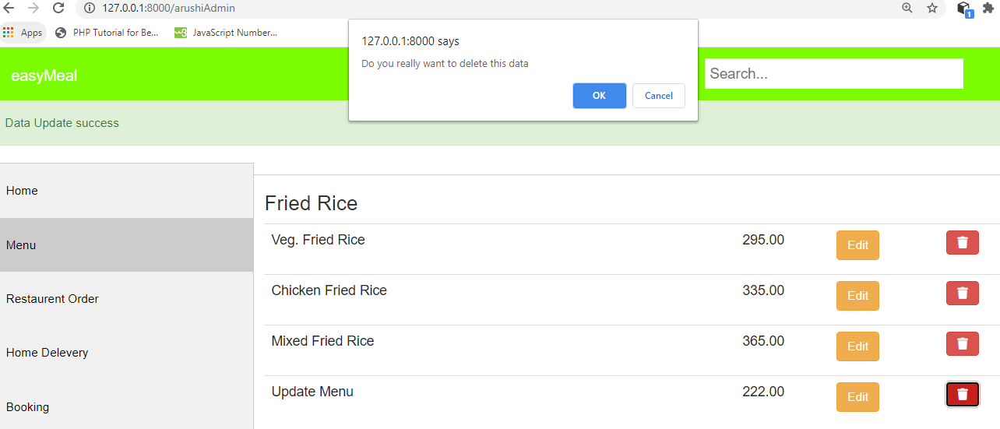 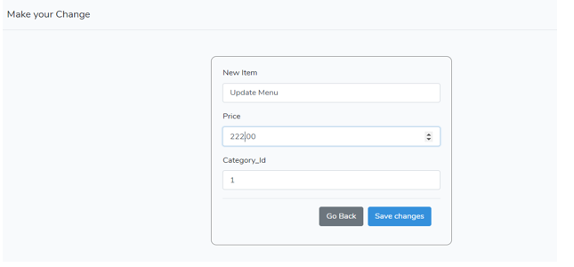

###### Code view
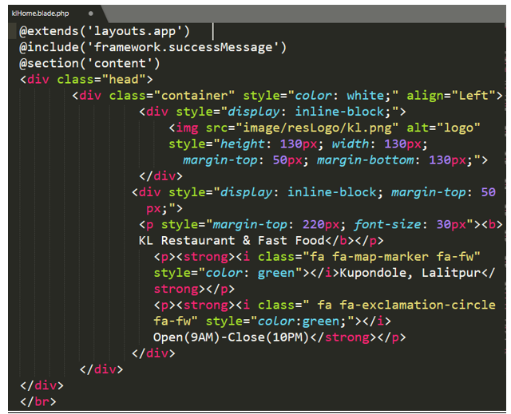
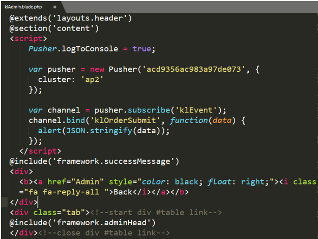

